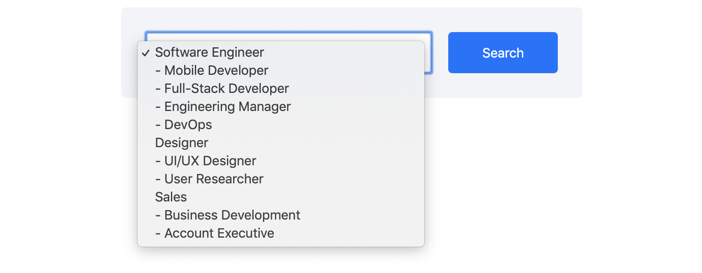

# Search Bar

You're an engineer here at AngelList. We've decided to iterate on the job search experience for candidates. You've been tasked with prototyping a simple search bar for candidates to filter jobs by role (e.g. engineer, designer).

Here are the mocks you've been given:




You'll be using vanilla JavaScript (no frameworks), HTML, and CSS to build this search bar.

Your code should:
- Make a `GET` request to `/roles` retrieve the list of role options.
- Create the dropdown with the options formatted as depicted in the mock.
- When the Search button is clicked, make a `POST` request to `/search` with the id of the selected role.
- Style the UI according to the mocks.

You'll write everything in the Coderpad. You'll see that there's a designated section for CSS, one for HTML, and one for JavaScript.

## How to make API requests

We've provided an `api` function for you to use. It takes an HTTP method and path to request, and an optional data argument (if you are making a `POST` request). The `api` function will return a promise that may have data. It can also potentially reject with an error.

```typescript
api(method: string, path: string, data?: any): Promise<any>
```

## Design specs

- All text is 16px
- All corners are rounded by 5px
- Colors: #f2f4f7 (light gray background), #0f6fff (blue)
- We provide the CSS for styling the select element to speed things up a bit
- Just eyeball everything else. No need to be pixel perfect -- remember, this is a prototype!
